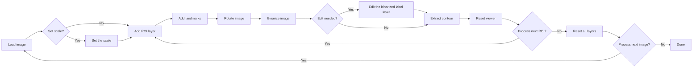

# Leaf Shape Analysis Tool

[**日本語のREADMEはこちら (Japanese README is here)**](README_ja.md)

A **[**napari**](https://napari.org/stable/)-based graphical user interface (GUI)** for fully reproducible extraction, orientation, and morphometric analysis of leaf outlines.  
This tool allows researchers to perform every processing step interactively — from setting image scale to exporting normalized Elliptic Fourier Descriptors (EFDs) — all within a single, unified environment.

## Key Features

| Step | Widget | Description |
|------|---------|-------------|
| 1️⃣ | **Set Scale** (`set_scale.py`) | Define the physical scale using DPI or a reference line (mm/cm/µm). Updates all visible layers and napari’s scale bar. |
| 2️⃣ | **Crop ROI** (`crop_rectangle.py`) | Interactively define rectangular or polygonal Regions of Interest (ROIs). Creates numbered ROI layers and associated landmark layers. |
| 3️⃣ | **Point Tools** (`make_points_tool_widget.py`) | Add and label landmarks (e.g., *base* and *tip*) for each ROI. Supports auto-labeling, undo, and label counter. |
| 4️⃣ | **Rotate Image** (`rotate_image.py`) | Rotate ROI images based on base–tip landmarks so that biological orientation (base → tip) is consistently rightward. |
| 5️⃣ | **Binarize Image** (`binarize_image.py`) | Generate binary masks using Otsu’s method or SAM2 segmentation. Metadata (thresholds, methods, manual edits) are stored automatically. |
| 6️⃣ | **Extract Contour** (`extract_contour.py`) | Extract the largest external contour, visualize it, and export coordinates and structured metadata (JSON/CSV). |
| 7️⃣ | **Compute EFDs** (`calculate_efd.py`) | Compute Elliptic Fourier Descriptors (EFDs), including *true normalization* (Wu et al., 2024), and export coefficients as CSV. |
| 8️⃣ | **Clear Viewer** (`clear_viewer.py`) | Safely reset the napari viewer while optionally keeping base images or ROIs, with automatic snapshot export. |                                         |

## Installation & Quick Start

You can install and launch the tool using [`uv`](https://docs.astral.sh/uv/) (recommended for reproducibility).

### Standard setup

```bash
git clone https://github.com/maple60/morphometrics-tool.git
cd morphometrics-tool
uv venv
source .venv/bin/activate   # or ".venv\Scripts\activate" on Windows
uv sync
leaf-shape-tool
```

## For development mode

```bash
uv pip install -e .
leaf-shape-tool
```

For more detailed installation options (including standalone executables and manual setup),
see the [Installation Guide](https://maple60.github.io/morphometrics-tool/installation.html).

## Usage Overview

After launching, the Leaf Shape Analysis Tool window will open in napari.
All steps—from loading an image to exporting EFD coefficients—can be completed interactively through the sidebar widgets.

See the [User Guide](https://maple60.github.io/morphometrics-tool/usage.html) for detailed instructions and tutorials.

## Workflow



Each processing step corresponds to a dedicated GUI widget,  
and all results (images, contours, metadata, EFDs) are automatically exported to the `output/` directory.

## Citation

準備中です

## Acknowledgements

Built upon open-source frameworks including [napari](https://napari.org/), [scikit-image](https://scikit-image.org/), [numpy](https://numpy.org/), [pandas](https://pandas.pydata.org/), and [matplotlib](https://matplotlib.org/).

## License 

Distributed under the BSD 3-Clause License. See [LICENSE](LICENCE) for more information.
