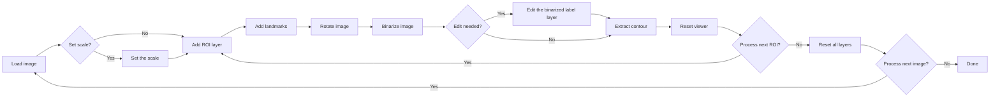

# LeafContourEFD

[**日本語のREADMEはこちら (Japanese README is here)**](README_ja.md)

**Full documentation:** [https://maple60.github.io/leaf-contour-efd/](https://maple60.github.io/leaf-contour-efd/)

A **[**napari**](https://napari.org/stable/)-based graphical user interface (GUI)** for fully reproducible extraction, orientation, and morphometric analysis of leaf outlines.  
This tool allows researchers to perform every processing step interactively — from setting image scale to exporting normalized Elliptic Fourier Descriptors (EFDs) — all within a single, unified environment.

## Key Features

- **User-friendly yet fully reproducible workflow**  
  A complete graphical interface built on [napari](https://napari.org/stable/) enables users to perform every step — from image loading to EFD export — without writing code.  
  All parameters, transformations, and processing histories are **automatically stored as structured metadata (JSON/CSV)**, ensuring full reproducibility.

- **Biologically consistent leaf orientation**  
  Leaf images are **aligned based on manually defined base–tip landmarks**, guaranteeing consistent orientation across samples.  
  This allows for direct comparison of leaf outlines across individuals, species, and populations.

- **Oriented True Normalized Elliptic Fourier Descriptors (EFDs)**  
  Implements a customized version of the **true normalized EFDs** following [Wu et al., (2024)](https://doi.org/10.48550/arXiv.2412.10795), enabling the computation of oriented descriptors that preserve biologically meaningful shape orientation and symmetry.

- **Flexible and editable segmentation options**  
  Provides both traditional Otsu thresholding ([Otsu, 1979](https://ieeexplore.ieee.org/document/4310076/)) and deep-learning–based [SAM2](https://ai.meta.com/sam2/) segmentation ([Ravi et al., 2024](https://arxiv.org/abs/2408.00714)), ensuring robust contour extraction under diverse imaging conditions.  
  Users can interactively adjust threshold values or manually refine segmentation masks using [napari](https://napari.org/stable/index.html)’s built-in painting, polygon, and erasing tools, achieving precise control while maintaining reproducibility.

- **Comprehensive metadata export**  
  Every processing step — scale calibration, ROI cropping, landmark placement, rotation, binarization, contour extraction, and EFD computation — is saved in machine-readable form, supporting transparent and reproducible shape analysis pipelines.

## Installation

There are three ways to install and run the LeafContourEFD.
Choose the method that best fits your environment.

| Method             | Description                                                                          | Recommended for        |
| ------------------ | ------------------------------------------------------------------------------------ | ---------------------- |
| **Standalone App** | Ready-to-use executables for Windows, macOS, and Linux. No Python required.                   | General users          |
| **Setup Script**   | Automatically creates a reproducible environment via `uv` and installs dependencies. | Reproducible workflows |
| **Manual Setup**   | Build the environment from scratch for development or debugging.                     | Developers             |

### 1. Standalone App (Recommended) 

Download the latest release from the [Releases page](https://github.com/maple60/leaf-contour-efd/releases)
No Python installation is required.

- On **Windows**: run `LeafContourEFD.exe`
- On **macOS**: run the app bundle or binary from the downloaded archive
- On **Linux**: extract the release archive and run `LeafContourEFD` from the `LeafContourEFD/` folder

::: {.callout-warning}
## If the app does not open on macOS

On macOS, a warning dialog may appear the first time you launch the app, and the app may not open.

If this happens, run the following command in Terminal:

```bash
/usr/bin/xattr -dr com.apple.quarantine ~/path/to/LeafContourEFD
```

Replace `~/path/to/LeafContourEFD` with the path to the downloaded app.

After running the command, try launching the app again.
:::

### 2. Setup Script

Clone the repository and launch the tool using the provided script.

```bash
git clone https://github.com/maple60/leaf-contour-efd.git
cd leaf-contour-efd
```
- Windows

```bash
setup\setup_windows.bat
```

- macOS / Linux

```bash
bash setup/setup_unix.sh
```

This script automatically:

- Creates a virtual environment (`uv venv`)
- Installs all dependencies from `uv.lock`
- Clones and installs [SAM2](https://github.com/facebookresearch/sam2)
- Verifies checkpoints for SAM2 models
- Launches the tool

### 3. Manual Setup (Developers)

If you prefer to configure everything manually:

```bash
uv venv
.venv\Scripts\activate       # source .venv/bin/activate  (macOS/Linux)
uv sync
git clone https://github.com/facebookresearch/sam2.git
cd sam2
uv pip install -e .
cd ..
```

If you plan to use Segment Anything Model 2 (SAM2) for segmentation, make sure its checkpoints are downloaded into `sam2/checkpoints/`.
For details about each model, refer to the following page:

- [Model Description - facebookresearch/sam2](https://github.com/facebookresearch/sam2#:~:text=(state)%3A%0A%20%20%20%20%20%20%20%20...-,Model%20Description,-SAM%202.1%20checkpoints)

After installation, launch the tool with:

```bash
leaf-contour-efd
```

> [!NOTE]
> For full setup instructions (including uv, git, and checkpoint downloads), see the [Installation Guide](https://maple60.github.io/leaf-contour-efd/installation.html).

## Workflow & Usage



Each processing step corresponds to a dedicated GUI widget,  
and all results (images, contours, metadata, EFDs) are automatically exported to the `output/` directory.

For a detailed step-by-step guide, please refer to the [Usage page](https://maple60.github.io/leaf-contour-efd/usage.html).

## Citation

Currently **in preparation**

## Acknowledgements

This tool is built upon the following open-source frameworks:

- [napari](https://napari.org/stable/): interactive image viewer framework  
- [scikit-image](https://scikit-image.org/): image processing library  
- [numpy](https://numpy.org/): numerical computation library  
- [pandas](https://pandas.pydata.org/): data analysis library  
- [matplotlib](https://matplotlib.org/): visualization and plotting library  

The design and implementation of this tool were inspired by the methodology and GUI software developed by [Wu et al. (2024)](https://doi.org/10.48550/arXiv.2412.10795), particularly the *ElliShape* interface ([https://www.plantplus.cn/ElliShape/](https://www.plantplus.cn/ElliShape/)).

We also acknowledge the contributions of many other open-source tools and studies  
that have advanced automated leaf image analysis.  
A summary of related software can be found on the [Related Tools page](https://maple60.github.io/leaf-contour-efd/related_tools.html).

We express our sincere gratitude to the open-source community and all contributors  
whose work made this tool possible.

## License 

Distributed under the BSD 3-Clause License. See [LICENSE](https://github.com/maple60/leaf-contour-efd/blob/main/LICENSE) for more information.

## AI Assistant

GitHub Copilot and ChatGPT were used to assist in drafting code
and revising documentation.

All methodological decisions and validations were conducted by the author.
The author assumes full responsibility for the scientific correctness
and reproducibility of this software.

## References

- Otsu, Nobuyuki. 1979. “A Threshold Selection Method from Gray-Level Histograms.” IEEE Transactions on Systems, Man, and Cybernetics 9 (1): 62–66. https://doi.org/10.1109/TSMC.1979.4310076.
- Ravi, Nikhila, Valentin Gabeur, Yuan-Ting Hu, Ronghang Hu, Chaitanya Ryali, Tengyu Ma, Haitham Khedr, et al. 2024. “SAM 2: Segment Anything in Images and Videos.” https://arxiv.org/abs/2408.00714.
- Wu et al. 2024. “Reliable and Superior Elliptic Fourier Descriptor Normalization and Its Application Software ElliShape with Efficient Image Processing.” https://doi.org/10.48550/arXiv.2412.10795
