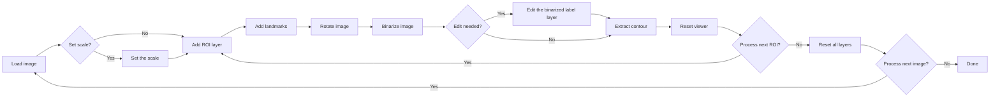

# Leaf Shape Analysis Tool

[**日本語のREADMEはこちら (Japanese README is here)**](README_ja.md)

A **[**napari**](https://napari.org/stable/)-based graphical user interface (GUI)** for fully reproducible extraction, orientation, and morphometric analysis of leaf outlines.  
This tool allows researchers to perform every processing step interactively — from setting image scale to exporting normalized Elliptic Fourier Descriptors (EFDs) — all within a single, unified environment.

## Key Features

- **User-friendly yet fully reproducible workflow**  

A complete graphical interface built on [napari](https://napari.org/stable/) enables users to perform every step — from image loading to EFD export — without writing code.  
  All parameters, transformations, and processing histories are **automatically stored as structured metadata (JSON/CSV)**, ensuring full reproducibility.

- **Biologically consistent leaf orientation**  
  Leaf images are **aligned based on manually defined base–tip landmarks**, guaranteeing consistent orientation across samples.  
  This allows for direct comparison of leaf outlines across individuals, species, and populations.

- **True Elliptic Fourier Descriptors (EFDs)**  
  Supports both conventional and *true normalized* EFDs (following [Wu et al., 2024](https://doi.org/10.48550/arXiv.2412.10795)), allowing morphometric analysis that preserves biologically meaningful orientation and symmetry.

- **Flexible and editable segmentation options**  
  Provides both traditional [Otsu thresholding](https://ieeexplore.ieee.org/document/4310076/) and deep-learning–based [SAM2](https://ai.meta.com/sam2/) segmentation ([Ravi et al., 2024](https://arxiv.org/abs/2408.00714)), ensuring robust contour extraction under diverse imaging conditions.  
  Users can interactively adjust threshold values or manually refine segmentation masks using *[napari](https://napari.org/stable/index.html)*’s built-in painting, polygon, and erasing tools, achieving precise control while maintaining reproducibility.

- **Comprehensive metadata export**  
  Every processing step — scale calibration, ROI cropping, landmark placement, rotation, binarization, contour extraction, and EFD computation — is saved in machine-readable form, supporting transparent and reproducible shape analysis pipelines.

## Installation

There are three ways to install and run the Leaf Shape Analysis Tool.
Choose the method that best fits your environment.

| Method             | Description                                                                          | Recommended for        |
| ------------------ | ------------------------------------------------------------------------------------ | ---------------------- |
| **Standalone App** | Ready-to-use executable for Windows and macOS. No Python required.                   | General users          |
| **Setup Script**   | Automatically creates a reproducible environment via `uv` and installs dependencies. | Reproducible workflows |
| **Manual Setup**   | Build the environment from scratch for development or debugging.                     | Developers             |

### 1. Standalone App (Recommended) (**In preparation**)

Download the latest release from the [Releases page](https://github.com/maple60/morphometrics-tool/releases/new)

- On **Windows**: run `LeafShapeTool.exe`
- On **macOS**: open `LeafShapeTool.app`

No Python installation is required.

### 2. Setup Script

Clone the repository and launch the tool using the provided script.

```bash
git clone https://github.com/maple60/morphometrics-tool.git
cd morphometrics-tool
```
- Windows

```bash
setup\setup_windows.bat
```

macOS / Linux (In preparation)

```bash
bash setup/setup_unix.sh
```

This script automatically:

- Creates a virtual environment (`uv venv`)
- Installs all dependencies from `uv.lock`
- Clones and installs [SAM2](https://github.com/facebookresearch/sam2)
- Verifies checkpoints for SAM2 models
- Launches the tool

### 3. Manual Setup (Developers)

If you prefer to configure everything manually:

```bash
uv venv
.venv\Scripts\activate       # source .venv/bin/activate  (macOS/Linux)
uv sync
git clone https://github.com/facebookresearch/sam2.git
cd sam2 && uv pip install -e . && cd ..
```

If you plan to use Segment Anything 2 (SAM2) for segmentation, make sure its checkpoints are downloaded into `sam2/checkpoints/`.
For details about each model, refer to the following page:

- [Model Description - facebookresearch/sam2](https://github.com/facebookresearch/sam2#:~:text=(state)%3A%0A%20%20%20%20%20%20%20%20...-,Model%20Description,-SAM%202.1%20checkpoints)

After installation, launch the tool with one of the following:

```bash
leaf-shape-tool
```

> [!NOTE]
> For full setup instructions (including uv, git, and checkpoint downloads), see the [Installation Guide](https://maple60.github.io/morphometrics-tool/installation.html).

### Optional: SAM2 Model

If you plan to use Segment Anything 2 (SAM2) for segmentation, make sure its checkpoints are downloaded into:

## Workflow



Each processing step corresponds to a dedicated GUI widget,  
and all results (images, contours, metadata, EFDs) are automatically exported to the `output/` directory.

## Citation

Currently **in preparation**

## Acknowledgements

Built upon open-source frameworks including [napari](https://napari.org/), [scikit-image](https://scikit-image.org/), [numpy](https://numpy.org/), [pandas](https://pandas.pydata.org/), and [matplotlib](https://matplotlib.org/).

## License 

Distributed under the BSD 3-Clause License. See [LICENSE](LICENCE) for more information.

## References

- Otsu, Nobuyuki. 1979. “A Threshold Selection Method from Gray-Level Histograms.” IEEE Transactions on Systems, Man, and Cybernetics 9 (1): 62–66. https://doi.org/10.1109/TSMC.1979.4310076.
- Ravi, Nikhila, Valentin Gabeur, Yuan-Ting Hu, Ronghang Hu, Chaitanya Ryali, Tengyu Ma, Haitham Khedr, et al. 2024. “SAM 2: Segment Anything in Images and Videos.” https://arxiv.org/abs/2408.00714.
- Wu et al. 2024. “Reliable and Superior Elliptic Fourier Descriptor Normalization and Its Application Software ElliShape with Efficient Image Processing.” https://doi.org/10.48550/arXiv.2412.10795