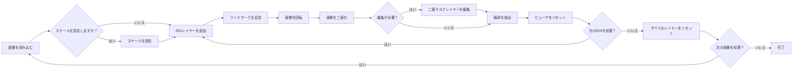

# Leaf Shape Analysis Tool

[English README is here (README.md)](https://github.com/maple60/morphometrics-tool/tree/main)

**ドキュメントサイト:** [https://maple60.github.io/morphometrics-tool/](https://maple60.github.io/morphometrics-tool/)

[**napari**](https://napari.org/stable/) を基盤としたグラフィカルユーザーインターフェース（GUI）で、葉の輪郭抽出・方向補正・楕円フーリエ記述子(elliptic Fourier descriptor) の算出を再現可能な形で実行できます。

スケール設定から正規化 Elliptic Fourier Descriptor (EFD) の出力まで、すべての処理を単一の環境内でインタラクティブに行うことができます。

## 主な特徴

- **ユーザーフレンドリーかつ再現性の高いワークフロー**  
    [**napari**](https://napari.org/stable/) を基盤とした全GUI環境により、画像の読み込みからEFD出力までをコード不要で実行可能です。
    すべてのパラメータ、変換履歴、処理手順は 構造化メタデータ（JSON/CSV）として自動保存 され、完全な再現性を保証します。

- **生物学的方向性を考慮した葉画像の整列**  
    葉の基部（base）と先端（tip）のランドマークを指定することで、サンプル間で一貫した方向に自動整列します。
    これにより、個体・種・集団間で生物学的に整合的な形態比較が可能です。

- **生物学的向きを考慮した True Normalized EFDs（Oriented True Normalized EFDs）**  
    [Wu et al., 2024](https://doi.org/10.48550/arXiv.2412.10795) に基づきつつ、独自に拡張した手法を実装し、生物学的に意味のある形状の向きと対称性を保持する **oriented true normalized EFDs** を算出可能。

- **柔軟かつ編集可能なセグメンテーション機能**  
    伝統的な大津の二値化手法 ([Otsu, 1979](https://ieeexplore.ieee.org/document/4310076/)) と、深層学習ベースの [SAM2](https://ai.meta.com/sam2/) セグメンテーション ([Ravi et al., 2024](https://arxiv.org/abs/2408.00714)) の両方を提供し、多様な画像条件下での堅牢な輪郭抽出を実現します。  
    さらに、閾値の再調整や、[napari](https://napari.org/stable/index.html) のペイント、ポリゴン、消しゴムツールを用いてセグメンテーションマスクを手動で微調整でき、正確な制御と再現性を両立します。
- **完全なメタデータ出力**  
    スケール設定、ROI抽出、ランドマーク指定、回転、二値化、輪郭抽出、EFD算出といったすべての処理過程が機械可読な形式（JSON/CSV）で保存され、透明性と再現性の高い解析パイプラインを実現します。

## インストール方法

本ツールは、以下の3つの方法で利用できます。
ご自身の環境に合わせてご選択ください。

| 方法              | 概要                                  | 推奨対象         |
| --------------- | ----------------------------------- | ------------ |
| **スタンドアロンアプリ**  | Windows/macOS向けの実行ファイル。Python環境は不要。 | 一般ユーザー       |
| **セットアップスクリプト** | `uv` により仮想環境を自動構築し、依存関係をインストール。     | 再現性を重視するユーザー |
| **手動セットアップ**    | 開発やデバッグ目的で、一から環境を構築。                | 開発者          |

### 1. スタンドアロンアプリ（推奨）【準備中】

最新のリリースは [Releasesページ](https://github.com/maple60/morphometrics-tool/releases/new) からダウンロードいただけます。

- **Windows**：`LeafShapeTool.exe` を実行
- **macOS**：`LeafShapeTool.app` を開く

Python のインストールは不要です。

### 2. セットアップスクリプト

リポジトリをクローンし、提供されているスクリプトでツールを起動します。

```bash
git clone https://github.com/maple60/morphometrics-tool.git
cd morphometrics-tool
```

- Windows

```bash
setup\setup_windows.bat
```

- macOS / Linux（準備中）

```bash
bash setup/setup_unix.sh
```

このスクリプトは以下の処理を自動で行います：

- 仮想環境の作成 (`uv venv`)
- `uv.lock` に基づく依存関係のインストール
- [SAM2](https://github.com/facebookresearch/sam2) のクローンとインストール
- SAM2 モデルのチェックポイントの検証
- ツールの起動

### 3. 手動セットアップ（開発者向け）

自分で環境を構築したい場合は、以下を実行します：

```bash
uv venv
.venv\Scripts\activate       # macOS/Linuxの場合は source .venv/bin/activate
uv sync
git clone https://github.com/facebookresearch/sam2.git
cd sam2 && uv pip install -e .
cd ..
```

SAM2 を利用する場合は、チェックポイントを sam2/checkpoints/ に配置してください。
モデルの詳細は以下のページを参照してください：

- [Model Description - facebookresearch/sam2](https://github.com/facebookresearch/sam2#:~:text=(state)%3A%0A%20%20%20%20%20%20%20%20...-,Model%20Description,-SAM%202.1%20checkpoints)

インストールが完了したら、以下の方法で起動します：

```bash
leaf-shape-tool
```

> [!NOTE]
> `uv`・`git`・チェックポイントのダウンロードなど、より詳細な手順は [Installation ページ](https://maple60.github.io/morphometrics-tool/installation.html) を参照してください。

### ワークフローと使い方



各処理ステップは専用のGUIウィジェットに対応しており、  
解析結果（画像・輪郭・メタデータ・EFD）は自動的に `output/` ディレクトリに保存されます。

詳しい操作手順については、[Usage ページ](https://maple60.github.io/morphometrics-tool/usage.html) を参照してください。

## 引用情報（Citation）

現在 **準備中** です。

## 謝辞（Acknowledgements）

本ツールは、以下のオープンソースフレームワークの上に構築されています：

- [napari](https://napari.org/stable/): 画像ビューアフレームワーク
- [scikit-image](https://scikit-image.org/): 画像処理ライブラリ
- [numpy](https://numpy.org/): 数値計算ライブラリ
- [pandas](https://pandas.pydata.org/): データ解析ライブラリ
- [matplotlib](https://matplotlib.org/): グラフ描画ライブラリ

また、[Wu et al., 2024](https://doi.org/10.48550/arXiv.2412.10795) の手法およびGUIツール [Ellishape](https://www.plantplus.cn/ElliShape/) から多くの着想を得ています。

さらに、本研究を支える数多くのオープンソースプロジェクトの開発者・貢献者の皆様に深く感謝申し上げます。

また、葉画像解析の自動化分野を発展させてきた多くのオープンソースツールや研究に感謝いたします。  
関連するソフトウェアの概要は、[Related Tools ページ](https://maple60.github.io/morphometrics-tool/related_tools.html) にまとめています。

## ライセンス

本ソフトウェアは **BSD 3-Clause License** の下で配布されています。
詳細は [LICENSE](https://github.com/maple60/morphometrics-tool/blob/main/LICENSE) をご覧ください。

## AI利用について

GitHub Copilot および ChatGPT を、コードの作成支援およびドキュメントの推敲に利用しました。

本ソフトウェアにおけるすべての方法論的判断および検証は、著者自身が行っています。
本ソフトウェアの科学的妥当性および再現性についての最終的な責任は、著者が負います。

## 参考文献

- Otsu, Nobuyuki. 1979. “A Threshold Selection Method from Gray-Level Histograms.” IEEE Transactions on Systems, Man, and Cybernetics 9 (1): 62–66. https://doi.org/10.1109/TSMC.1979.4310076.
- Ravi, Nikhila, Valentin Gabeur, Yuan-Ting Hu, Ronghang Hu, Chaitanya Ryali, Tengyu Ma, Haitham Khedr, et al. 2024. “SAM 2: Segment Anything in Images and Videos.” https://arxiv.org/abs/2408.00714.
- Wu et al. 2024. “Reliable and Superior Elliptic Fourier Descriptor Normalization and Its Application Software ElliShape with Efficient Image Processing.” https://doi.org/10.48550/arXiv.2412.10795