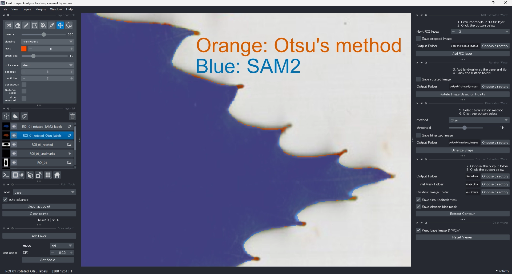

::: {.callout-note}
## 🇯🇵 日本語版 / Available in Japanese

日本語で読みたい方は [こちらのページ](usage_ja.qmd) をご覧ください。  
Please see the [Japanese version](usage_ja.qmd) for reading in Japanese.
:::

This section describes how to use the **Leaf Shape Analysis Tool** through its graphical user interface (GUI).  
All steps — from ROI cropping to EFD export — can be performed interactively within a single window.

---

## Workflow Overview

The overall workflow is summarized below.  
Each step can be performed through the corresponding GUI widget.

::: {style="text-align: center;"}
```{mermaid}
---
config:
  layout: dagre
---
flowchart TD
    A["Load image"] --> B{"Set scale?"}
    B -- Yes --> B1["Set the scale"]
    B -- No --> C["Add ROI layer"]
    B1 --> C
    C --> D["Add landmarks"]
    D --> E["Rotate image"]
    E --> F["Binarize image"]
    F --> G{"Edit needed?"}
    G -- Yes --> G1["Edit the binarized label layer"]
    G1 --> H["Extract contour"]
    G -- No --> H
    H --> J["Reset viewer"]
    J --> L{"Process next ROI?"}
    L -- Yes --> C
    L -- No --> M["Reset all layers"]
    M --> N{"Process next image?"}
    N -- Yes --> A
    N -- No --> O["Done"]
```
:::

Each step is explained in detail [below](@sec-step-by-step).

---

## Step-by-Step Guide {#sec-step-by-step}

### Launch the Application

After installation, start the application.  
The **[napari](https://napari.org/stable/) viewer** window will appear as shown below.

{fig-alt="Initial window" fig-align="center" #fig-initial-window}

---

### Load an Image {#sec-load-image}

To load an image, select **File > Open** from the menu bar, or simply drag and drop a file into the viewer.  
Shortcut: **Ctrl + O** (Windows / Linux) or **Cmd + O** (macOS).

{fig-alt="How to open a image" fig-align="center" #fig-fig-open-image}

::: {.callout-note}
## Supported Image Formats

Supported formats include `.jpg`, `.png`, `.tif`, and `.bmp`.
:::

When loaded, the image appears as a new layer named after the file, and an **ROIs** layer is automatically created on top of it.

{fig-alt="Image loaded" fig-align="center" #fig-image-loaded}

---

### (Optional) Set the Scale {#sec-set-scale}

If your image includes a scale bar or accurate DPI information,  
you can define the pixel-to-centimeter ratio using the **Scale Setter widget**.  
This step is optional.  
Once the scale is set, the enclosed area of each contour will be recorded in cm² in the exported data.

#### Set Scale Using a Scale Bar

1. Click **Add Layer** to create a **Scale Measurement** shapes layer {width="24"}.
2. Set the **mode** to `px/cm`.
3. Zoom in on the scale bar and confirm that **Add lines** {width="24"} is selected.
4. Drag a line along the known scale bar length.
5. Enter the real length and unit (default: 1 cm).
6. Click **Set Scale** to apply.

{fig-alt="Set scale (px/cm mode)" fig-align="center" #fig-set-scale-px-cm-mode}

#### Set Scale Using DPI

- Set **mode** to `dpi` (default).
- Enter the image DPI in the **DPI** field (default: 300 dpi).

{fig-alt="Set scale (dpi mode)" fig-align="center" #fig-set-scale-dpi-mode}

::: callout-tip
## Recommended Scan Resolution

For scanned leaves, a resolution of **300–400 dpi** is typically sufficient, balancing detail, speed, and file size [e.g. @shi2021; @viscosi2009].

For images without fine serrations, even **50 dpi** may be adequate [@neto2006a]。
:::

---

### Crop Region of Interest (ROI) {#sec-crop-ROI}

Use the **Crop Rectangle widget** to define a region of interest (ROI).  
Click **Add ROI Layer** and draw a rectangular selection around the target leaf.

1.  Confirm that the **ROIs** layer is active.
2.  Select the **Add rectangle** tool {width="24"} and draw a rectangle over the target object.
3.  Click **Add ROI Layer**.
4.  A cropped image layer named `ROI_01` and a point layer `ROI_01_landmarks` will be created automatically.

::: callout-note
## What Is ROI?

ROI (*Region of Interest*) refers to the specific part of an image selected for analysis.  
In leaf-shape studies, the ROI typically corresponds to the leaf area cropped from the scanned image,  
which helps exclude irrelevant background regions.
:::

{fig-alt="Draw ROI rectangle" fig-align="center" #fig-draw-ROI-rectangle}

::: callout-tip
## Navigation

- **Zoom** using the mouse wheel.
- **Pan** using the **Move camera** {width="24"}
- While in **Add rectangle** mode {width="24"}, you can also pan by **holding the spacebar while dragging** (though the behavior may vary).
- To delete an incorrect rectangle, use **Delete selected shapes** tool {width="24"}.
- The **Next ROI index** field increments automatically after each ROI, but can be adjusted manually.
:::

::: callout-note
## Saving Options"

-  **Save cropped image:** Enable or disable saving cropped ROIs (default: on).
- **Output Folder:** Default = `output/cropped_images/`. Use **Choose directory** to change.
:::

---

### Add Landmarks and Rotate Image

Add two landmarks (base and tip) using the **Landmark Tool**.  
These define the biological orientation of the leaf.

1. Select the `ROI_XX_landmarks` layer (XX = ROI index).
2. Click the **base** point.
3. Click the **tip** point.
4. Click **Rotate Image Based on Points**.
5. The image will be rotated so that the base points left (−x) and the tip points right (+x).  
A new rotated image layer (`ROI_XX_rotated`) will appear.

{fig-alt="Added landmarks" #fig-added-landmarks}

::: callout-tip
## Interaction Tips

- Use **Add points** tool {width="24"} to add landmarks.
- The label automatically advances from *base* to *tip*.
- Use the **label** dropdown to change the current label manually.
- **Auto advance** toggles automatic label progression (default: on).
- **Undo last point** removes the most recent landmark.
- **Clear points** deletes all current landmarks.
:::

::: callout-note
## Saving Options

- **Save rotated image:** Enable or disable saving rotated images (default: on).
- **Output Folder:** Default = `output/rotated_images/`. Use **Choose directory** to change.
:::

---

### Generate a Binarized Mask

To extract the leaf contour, convert the rotated image to a binary mask.

::: callout-note
## About Binarization

*Binarization* converts a grayscale image into two tones — typically white (object) and black (background) — based on pixel intensity. This enhances contrast and allows precise contour extraction.

The tool supports both manual and automatic thresholding, including **Otsu’s method** [@otsu1979].
:::

Two methods are available:

-   Otsu's method [@otsu1979]: 
    A statistical thresholding algorithm that automatically finds the optimal threshold from the image histogram.
-   Segment Anything Model 2 (SAM2) [@ravi2024sam2segmentimages]: 
    A deep-learning segmentation model developed by [Meta](https://www.meta.com/about/).
    It performs well on complex or noisy backgrounds.

For clean scanned images (dark leaf on white background), Otsu’s method is typically sufficient and faster.  
If the leaf is faint or the background complex, SAM2 may yield better segmentation.

#### Using Otsu’s Method

1. In the **Binarization Widget**, set **method = Otsu**.
2. Click **Binarize image**.
3. A new label layer `ROI_XX_rotated_Otsu_labels` will appear with the binary mask (orange overlay).
4. Adjust the **threshold** slider to fine-tune the result.

{fig-alt="Added landmarks" #fig-binarized-by-otsu}

#### Using SAM2

1. In the **Binarization Widget**, set **method = SAM2**.
2. Click **Binarize image**.
3. A label layer `ROI_XX_rotated_SAM2_labels` will appear (blue overlay).

::: {.callout-caution}
## Note

Due to technical limitations, SAM2 is currently **not available in the standalone version**.  
To use SAM2, please run the Python version instead.
:::

::: callout-note
## Saving Options

- **Save binarized image:** Enable or disable saving binary masks (default: on).
- **Output Folder:** Default = `output/binarized_images/`. Use **Choose directory** to change.
:::

::: {.callout-tip}
## Comparing Methods

You can compare Otsu and SAM2 results visually: run both methods on the same ROI — orange masks (Otsu) and blue masks (SAM2) are semi-transparent (opacity = 0.5), allowing easy overlay comparison (@fig-comparison-between-two-methods).  

You may also export both masks for later analysis.

{fig-alt="Added landmarks" #fig-comparison-between-two-methods}
:::

---

### Edit Binarized Mask (if needed)

If the automatically generated mask requires refinement:

- Adjust the threshold (Otsu only).
- Edit the label layer manually using napari’s painting tools.

Available tools:

<head></head>

| Tool | Use |
| --- | --- |
| **Paint brush** {width="24"}| Fill missing or small areas |
| **Polygon tool** {width="24"}| Add or correct large regions |
| **Label eraser** {width="24"}| Remove unwanted areas |


#### Editing with Paint Brush

1. Select `ROI_XX_rotated_<method>_labels`.
2. Choose **paint brush** tool {width="24"}.
3. Click and drag to fill or correct missing regions.

::: {.callout-tip}
## Brush Settings

You can adjust in **layer controls**:

- *Opacity* (default = 0.5)
- *Brush size* (default = 10 px)
:::

#### Editing with Polygon Tool

1. Select `ROI_XX_rotated_<method>_labels`.
2. Choose **polygon** tool {width="24"}.
3. Click around the desired area to form a polygon; double-click to close it.
    The enclosed region will be added to the mask.

#### Editing with Label Eraser

1. Select `ROI_XX_rotated_<method>_labels`.
2. Choose **label eraser** tool {width="24"}.
3. Click and drag to remove unwanted mask regions.

::: {.callout-tip}
## Editing Guidance

To exclude the petiole and keep only the lamina, erase the connecting region between the leaf and petiole.  
Since contour extraction later uses the *largest connected component*, it is unnecessary to fill every small gap completely.
:::

---

### Extract Contour

Once the mask is finalized, extract the contour.

1. Select `ROI_XX_rotated_<method>_labels`.
2. In the **Contour Extraction Widget**, click **Extract Contour**.
3. The contour (cyan outline) will appear, and a new layer `ROI_XX_rotated_<method>_labels_contour` will be added (@fig-contour).

{fig-alt="Extracted contour" fig-align="center" #fig-contour}

During this step, both the **EFD** and **oriented true normalized EFD** are automatically computed and exported together with metadata.

::: {.callout-note}
## If Contour Extraction Fails

If the contour is incorrect, delete `ROI_XX_rotated_<method>_labels_contour` and return to the previous step to refine the mask.
:::

::: callout-note
## Saving Options

- **Save final (edited) mask:** Enable or disable saving the manually corrected mask (default: on).
- **Save chosen blob mask:** Default = `output/binarized_images/`. Use **Choose directory** to change.
:::

---

### Reset and Continue

After extracting contours, you can reset the viewer and proceed to the next ROI or image.

#### Proceed to Next ROI

1. Check **Keep base image & ‘ROIs’**, then click **Reset Viewer**.  
The base image and ROI preview remain visible.
2. Return to @sec-crop-ROI to define the next region.

#### Proceed to Next Image

1. With **Keep base image & ‘ROIs’** checked, click **Reset Viewer**.
2. Verify that all ROIs are processed.
3. Uncheck **Keep base image & ‘ROIs’**, then click **Reset All Layers**.  
The viewer resets to its initial state.
4. Return to @sec-load-image to start a new image.

::: callout-note
## Saving Options

- **Save ROIs (Image + ROIs + ROI labels):** Enable or disable saving ROI preview images (default: on).
- Default output = `output/rois/<image>/`, where `<image>` is the file name (without extension).  
Use **Select file** to change.
:::

---

## Output Files

All metadata and analysis results are exported automatically to the designated output directory (default: `./output/`).  
The default folder structure is as follows:

| Folder | Content |
| --- | --- |
| `binarized_image_final` | Final edited binary masks |
| `binarized_images` | Automatically generated binary masks |
| `coefficients_efd` | Raw EFD coefficients |
| `coefficients_efd_normalized` | Normalized (oriented true) EFD coefficients |
| `contour` | Extracted contour coordinates |
| `contour_image` | Binary contour images (white = contour, black = background) |
| `cropped_images` | ROI-cropped original images |
| `metadata` | Metadata in `.json` and `.csv` formats |
| `rois` | ROI overview images (resized to ½ of the original) |
| `rotated_images` | Cropped images rotated based on landmarks |

---

### Metadata File

For each processed ROI, metadata are saved in both `.json` and `.csv` formats:

- `<image_id>_<ROI_id>.json`
- `<image_id>_<ROI_id>.csv`

where `<image_id>` is the original image file name (without extension) and `<ROI_id>` is the ROI number (zero-padded, e.g., 01, 02, 10).


::: callout-tip
## Example

For example, the second ROI of `leaf001.jpg` produces: `leaf001_02.json` and `leaf001_02.csv`.  
ROI indices start from 01.
:::

Default output directory: `output/metadata/`.

Metadata include ROI coordinates, rotation angle, scale information, binarization parameters, and more.

---

#### Metadata Structure (JSON)

Each JSON file contains detailed processing information:

-   metadata_version
-   source
    -   absolute_path
    -   relative_path
    -   image_id
    -   roi_index
-   scale
    -   px_per_cm
    -   unit
    -   scale_factors
    -   dpi
-   roi
    -   polygon_yx
    -   bbox_ymin_ymax_xmin_xmax
    -   corners_yx
    -   slice_indices
-   rotation
    -   angle_deg
    -   original_size
    -   rotated_size
-   landmarks
    -   points_layer_name
    -   points_n
    -   points_labels
    -   base_original
    -   tip_original
    -   base_rotated
    -   tip_rotated
-   binarization
    -   method
    -   threshold
    -   manually_edited: boolean (`true` / `false`)
-   contour
    -   points
    -   area
-   meta
    -   created_time
    -   cropped_from
    -   face_color_type
    -   border_color_type
-   processing_history
    - Each JSON file contains detailed processing information:

The CSV file includes a simplified subset of these data for statistical analysis.

::: callout-caution
## Character Encoding

CSV files use **UTF-8** encoding.  
When opening in Microsoft Excel, select “Import Text/CSV” and specify UTF-8 encoding to prevent garbled characters.
:::

---

## Recommended Workflow for Users

1. Launch the tool and load an image.
2. Follow Steps 1–9 for each ROI.
3. Use exported data directly for analysis in **R** (e.g., with [**Momocs**](https://momx.github.io/Momocs/) package [@Bonhomme2014momocs]) in [R](https://www.r-project.org/) or [**Python**](https://www.python.org/) (e.g. [PyEFD](https://pyefd.readthedocs.io/en/latest/)).

---

### Icon Credits

Icons such as *Add Shapes*, *Paint*, *Erase*, and *Polygon* used in the Usage section are derived from the [napari](https://github.com/napari/napari) open-source project (© napari contributors), distributed under the [BSD 3-Clause License](https://github.com/napari/napari/blob/main/LICENSE).
They have been used here solely for illustrative purposes.

---

## References

::: {#refs}
:::
